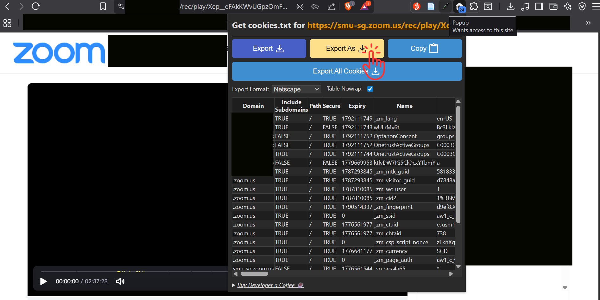

# Zoom Recorder Downloader

This script downloads Zoom cloud recordings using `yt-dlp`.

## Password-Protected Videos

For password-protected Zoom recordings, this project uses `cookies.txt` instead of passcode input.  
Passcode-only extraction is not reliable here; use [Cookies Setup](#cookies-setup).

## Usage

There are 2 ways to run this app:

1. Download prebuilt release zip (no Python setup needed)
2. Clone and run from source code

### 1. Run from Release Zip

#### Requirements

- Windows or macOS
- Internet access (to reach Zoom recording URLs)

#### Steps

- Download the correct release asset for your OS/architecture:
  - `zoom-downloader-windows-x64.zip`
  - `zoom-downloader-macos-arm64.zip` (Apple Silicon)
  - `zoom-downloader-macos-x64.zip` (Intel)
- Extract the zip.
- Run the launcher:
  - Windows: `Run Zoom Downloader.bat`
  - macOS: `Run Zoom Downloader.command`

#### Verify download integrity (SHA-256)

Each release also includes matching checksum files:

- `zoom-downloader-windows-x64.zip.sha256`
- `zoom-downloader-macos-arm64.zip.sha256`
- `zoom-downloader-macos-x64.zip.sha256`

Verify before extracting/running:

- Windows (PowerShell):

```powershell
$expected = (Get-Content .\zoom-downloader-windows-x64.zip.sha256).Split(" ")[0].ToLower()
$actual = (Get-FileHash .\zoom-downloader-windows-x64.zip -Algorithm SHA256).Hash.ToLower()
$expected -eq $actual
```

- macOS:

```bash
shasum -a 256 -c zoom-downloader-macos-arm64.zip.sha256
```

The check should report success (`True` on PowerShell, `OK` on macOS).

> [!CAUTION]
> Downloading and running executables carries inherent security risks. Only proceed if you explicitly trust the developer. Even then, always verify the file's hash before execution using the checksum mentioned earlier.


>
> **Security note**:
>- Release binaries are unsigned (macOS: not notarized, Windows: not code-signed), so first-run security warnings are expected.
>
> **If blocked on macOS**:
>- Open **System Settings -> Privacy & Security**.
>- Under Security, allow the blocked app, then run `Run Zoom Downloader.command` again.
>
> **If blocked on Windows**:
>- In SmartScreen, click **More info**.
>- Click **Run anyway**.

### 2. Run from Code (Clone)

#### Requirements

- Windows/macOS/Linux with terminal access
- Python 3.10 or newer
- `uv` installed
- Internet access (to reach Zoom recording URLs)

#### Steps

```powershell
git clone https://github.com/matthew-ngzc/zoom-downloader.git
cd zoom-downloader
uv venv
uv sync
uv run python zoom_recording_downloader.py
```

## Cookies Setup

For password-protected recordings, get `cookies.txt` and provide its path in the script prompt.

- Install **Get cookies.txt LOCALLY**:  
  https://chromewebstore.google.com/detail/get-cookiestxt-locally/cclelndahbckbenkjhflpdbgdldlbecc
- Open the Zoom recording page in your browser and make sure it is unlocked/playable.
- Export cookies in Netscape format and save as `cookies.txt`.
  
- When prompted for `Cookies file path`, you can use:
- Relative filename, e.g. `cookies.txt` (resolved to `<project>/zoom_recorder/cookies/cookies.txt`)
- Relative path, e.g. `archive/cookies2.txt` (resolved to `<project>/zoom_recorder/cookies/archive/cookies2.txt`)
- Absolute path, e.g. `C:\Users\yourname\Downloads\cookies.txt`
- If you leave cookie path blank and the recording appears protected, the script auto-retries with `zoom_recorder/cookies/cookies.txt` when that file exists.

## Developer Notes

### 1. Install dev dependencies

```powershell
uv sync --dev
```

### 2. Run locally (dev)

```powershell
uv run python zoom_recording_downloader.py
```

### 3. Build executable (PyInstaller + spec)

```powershell
uv run pyinstaller --noconfirm --clean zoom-downloader.spec
```

### 4. Optional: run release e2e tests locally

1. Copy `.env.example` to `.env`.
2. Fill these values in `.env`:
   - `E2E_ZOOM_PUBLIC_URL`
   - `E2E_ZOOM_PROTECTED_URL`
   - `E2E_ZOOM_PROTECTED_PASSCODE` (for passcode-refresh e2e path)
   - `E2E_ZOOM_COOKIES_TXT_B64` (for cookie-b64 e2e path)
3. Run:

```powershell
uv run pytest -m e2e -q
```

Build output is generated in:

- `dist/zoom-downloader.exe` (Windows)
- `build/` (PyInstaller build artifacts)

For release packaging, this repo's GitHub Actions workflow creates OS-specific zip bundles:

- `zoom-downloader-windows-x64.zip` includes `zoom-downloader.exe` + `Run Zoom Downloader.bat`.
- `zoom-downloader-macos-arm64.zip` includes `zoom-downloader` + `Run Zoom Downloader.command`.
- `zoom-downloader-macos-x64.zip` includes `zoom-downloader` + `Run Zoom Downloader.command`.
- Each zip has a corresponding `.sha256` file for integrity verification.

Release-tag CI (`v*`) also runs e2e tests using GitHub secrets:

- `E2E_ZOOM_PUBLIC_URL`
- `E2E_ZOOM_PROTECTED_URL`
- `E2E_ZOOM_PROTECTED_PASSCODE`

On release tags, CI uses Playwright to open the protected recording URL, submit passcode, and generate a fresh `cookies.txt` dynamically for e2e tests.  
You do not need to store `E2E_ZOOM_COOKIES_TXT_B64` in GitHub secrets for CI.

CI also includes:

- Static analysis: `ruff`
- Dependency vulnerability scan: `pip-audit`
- Secret scan: GitGuardian (`GITGUARDIAN_API_KEY` repository secret; scan is skipped with warning if not configured)

### 5. Trigger a release

Releases are triggered by pushing a git tag that starts with `v` (for example `v1.0.0`).

- Push to `main` (without tag): runs checks/tests/build, no GitHub Release publish.
- Push `v*` tag: runs release e2e + publish steps.

```powershell
git checkout main
git pull origin main
git tag v1.0.0
git push origin v1.0.0
```

If code is already committed locally, you can push code + tag in one shot:

```powershell
git push origin main v1.0.0
```

If code is already on remote `main` and you only want to release that commit, push only the tag:

```powershell
git push origin v1.0.0
```

If you need to move a mistaken tag:

```powershell
git tag -d v1.0.0
git push origin :refs/tags/v1.0.0
```

# TODOS
- explore TUI with Textual
- add more cicd stuff
  - [ ] dependabot
  - [ ] codeql
  - [ ] zizmor (github actions security checker)
